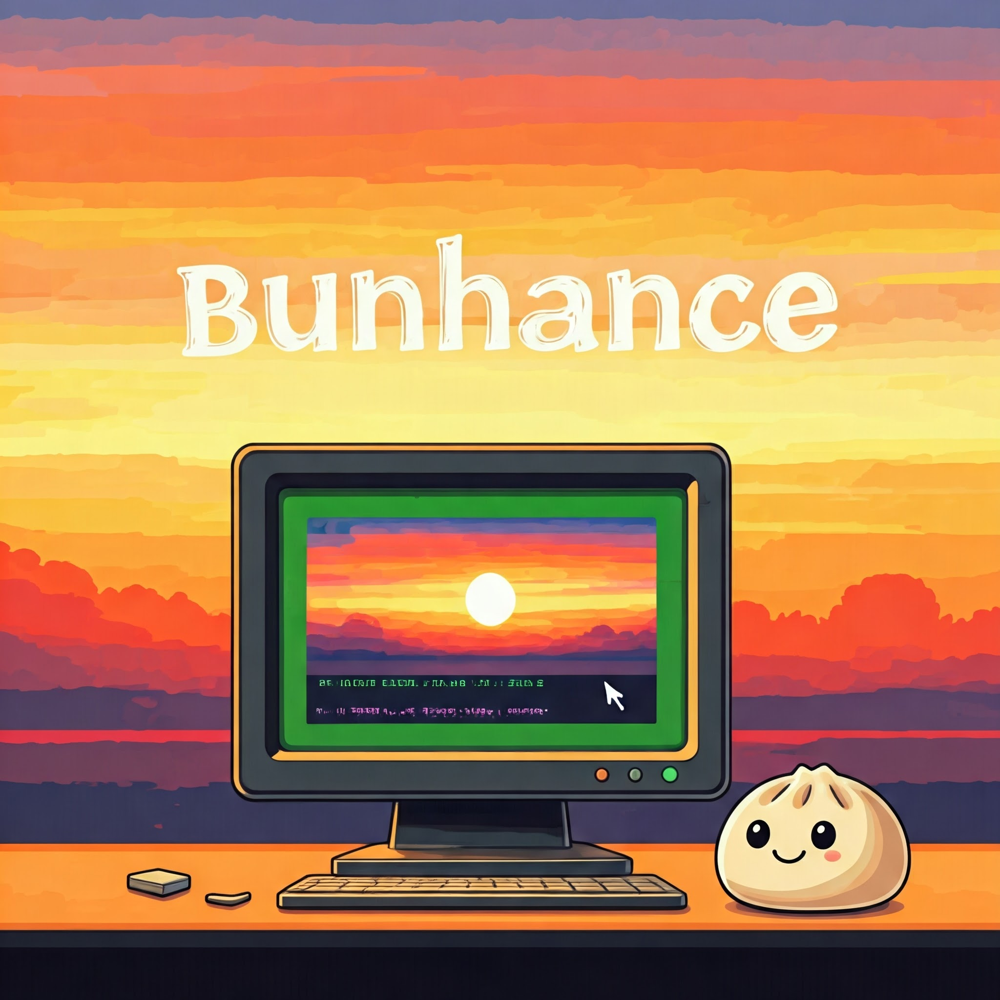

<p align="center">
  
</p>

<h1 align="center">Bunhance</h1>

<p align="center">
  <strong>🎨 Ultra-fast terminal styling library optimized for Bun</strong>
</p>

<p align="center">
  <a href="https://www.npmjs.com/package/bunhance"></a>
  <a href="https://github.com/yourusername/bunhance/blob/main/LICENSE"></a>
</p>

## ✨ Overview

Bunhance is a modern terminal styling library built specifically for Bun, with support for Node.js and Deno. It provides an intuitive API for creating beautifully styled CLI applications with features like:

- 🎨 Full RGB, HSL, and HEX color support
- 🌈 Beautiful text gradients
- ✨ Dynamic animations and effects
- 🎭 Text styling (bold, italic, underline, etc.)
- 🎯 Custom themes and presets
- ⚡ Zero dependencies

## 🚀 Installation

```bash
# Pick your favorite package manager! 🎯
bun add bunhance     # 🥟 Super fast with Bun!
npm install bunhance # 📦 Classic Node.js
yarn add bunhance    # 🧶 Yarn works too!
pnpm add bunhance    # 🏃 Speed demon PNPM
```

## 🎯 Basic Usage

```typescript
import { bunhance } from 'bunhance';

// Let's make your terminal beautiful! 🎨
console.log(bunhance.red('❌ Oops! Something went wrong!'));
console.log(bunhance.green.bold('✅ Great success!'));
console.log(bunhance.blue.italic('ℹ️ Here\'s some info...'));

// Mix and match colors like a pro! 🎨
console.log(bunhance.rgb(255, 100, 50)('�� Hot orange text!'));
console.log(bunhance.hsl(280, 100, 50)('�� Perfect purple!'));
console.log(bunhance.hex('#ff5733')('�� Designer approved!'));
```

## 🌈 Gradients

Create beautiful text gradients with multiple color stops:

```typescript
// Create stunning gradients! ✨
console.log(
  bunhance.gradient('#ff0000', '#00ff00')(
    '🌅 Sunset vibes...'
  )
);

// Or go wild with multiple colors! 🎪
console.log(
  bunhance.gradient(
    '#ff0000', // Red
    '#ffa500', // Orange
    '#ffff00', // Yellow
    '#00ff00', // Green
    '#0000ff'  // Blue
  )('🌈 The whole rainbow!')
);
```

## ✨ Animations

Add dynamic effects to your terminal output:

```typescript
// Make your text come alive! 🎬
const rainbow = bunhance.rainbow(
  '✨ Watch the colors dance! ✨'
);
bunhance.start(rainbow);

// Add some drama! 🎭
const glitch = bunhance.glitch(
  '⚠️ SYSTEM MALFUNCTION ⚠️'
);
bunhance.start(glitch);

// Create a sparkly effect! ⭐
const sparkle = bunhance.sparkle(
  '🌟 Magic happening here! 🌟'
);
bunhance.start(sparkle);
```

## 🎨 Custom Themes

Create reusable themes for consistent styling:

```typescript
import { createTheme } from 'bunhance';

// Create your perfect theme! 🎨
const theme = createTheme({
  error: { 
    color: 'red', 
    bold: true,
    prefix: '❌ ' 
  },
  success: { 
    color: 'green', 
    bold: true,
    prefix: '✅ ' 
  },
  info: { 
    color: 'blue', 
    italic: true,
    prefix: 'ℹ️ ' 
  },
  warning: {
    color: '#ffa500',
    bold: true,
    prefix: '⚠️ '
  }
});

// Use your theme with style! 🎯
console.log(theme.error('Operation failed!'));
console.log(theme.success('Mission accomplished!'));
console.log(theme.info('System status: Online'));
console.log(theme.warning('Running low on coffee!'));
```

## 🛠️ API Reference

### Basic Colors
- `bunhance.red(text)`
- `bunhance.green(text)`
- `bunhance.blue(text)`
- `bunhance.yellow(text)`
- `bunhance.magenta(text)`
- `bunhance.cyan(text)`
- `bunhance.white(text)`
- `bunhance.black(text)`

### Modifiers
- `bunhance.bold(text)`
- `bunhance.dim(text)`
- `bunhance.italic(text)`
- `bunhance.underline(text)`
- `bunhance.inverse(text)`
- `bunhance.hidden(text)`
- `bunhance.strikethrough(text)`

### Custom Colors
- `bunhance.rgb(r, g, b)(text)`
- `bunhance.hsl(h, s, l)(text)`
- `bunhance.hex(code)(text)`

### Gradients
- `bunhance.gradient(...colors)(text)`
- `bunhance.rainbow(text)`

### Animations
- `bunhance.rainbow(text, options)`
- `bunhance.glitch(text, options)`
- `bunhance.pulse(text, options)`
- `bunhance.sparkle(text, options)`

## 🤝 Contributing

Contributions are welcome! Feel free to:
- Report bugs
- Suggest new features
- Submit pull requests

Please read our [Contributing Guide](CONTRIBUTING.md) for details on our code of conduct and development process.

## 📝 License

This project is licensed under the MIT License - see the [LICENSE](LICENSE) file for details.

## 🙏 Acknowledgments

- Inspired by libraries like [Chalk](https://github.com/chalk/chalk)
- Built with [Bun](https://bun.sh)

<p align="center">Made with ❤️ by the Bunhance team</p>
